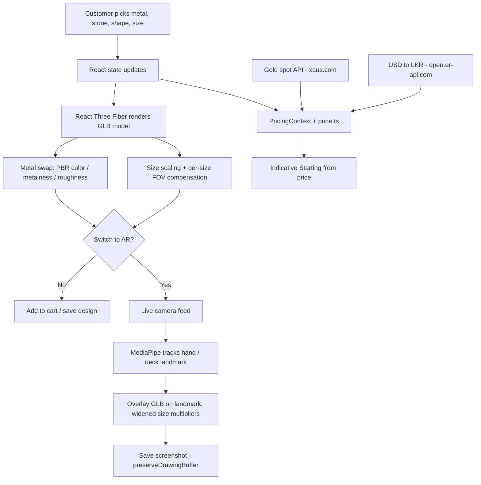

# PD Jewellers

A full-stack MERN e-commerce platform for jewellery business in Sri Lanka. Its novelty feature is a live **3D jewellery configurator** paired with camera-based **AR try-on**.

**Live site:** Coming Soon

---

## Tech Stack

| Layer | Tool | Role |
|---|---|---|
| Frontend | React 18 + TypeScript + Vite | SPA and build tooling |
| Styling | Tailwind CSS v4 | UI styling |
| 3D rendering | React Three Fiber + Three.js | Renders the GLB model in the configurator |
| 3D models | GLB format | Ring and pendant geometry |
| Model optimization | `@gltf-transform/core` (meshopt) | Compresses GLB files before upload |
| AR tracking | MediaPipe | Hand tracking for rings, face/neck for pendants |
| Backend | Node.js + Express + TypeScript | REST API and SPA serving |
| Database | MongoDB Atlas + Mongoose | Products, orders, users, designs |
| Media storage | Cloudinary | Images and GLB (`resource_type: 'raw'`) |
| Email | Nodemailer + Gmail SMTP | Transactional notifications |
| Market data | `xaus.com`, `open.er-api.com` | Gold spot price and USD to LKR rate |
| Export | `jspdf`, `html2canvas-pro` | Dashboard PDF and CSV export |
| Deployment | Render (single Web Service) | Express serves the built Vite SPA, auto-deploy on push to `main` |

---

## Novelty Feature: 3D Configurator + AR Try-On

The whole system connects three pipelines: 3D rendering, live pricing, and AR overlay.

**Flow:**

1. The customer picks metal, stone, shape and size. This updates React state.
2. React Three Fiber renders the GLB model. The metal swap changes PBR material properties (color, metalness, roughness) live, and the size change scales the geometry with a per-size camera FOV adjustment so the size stays visible on screen.
3. At the same time, the live gold rate flows through `PricingContext` and the `price.ts` helpers to show an indicative "Starting from" price that reacts to the metal and stone choice.
4. If the customer switches to AR, the same model is handed to a live camera feed. MediaPipe tracks the hand or neck landmark and overlays the model on it in real time. Size multipliers are widened here so differences read clearly on a phone.
5. The customer can save a screenshot of the try-on (`preserveDrawingBuffer: true`), or add the design to cart / save it.

**Process diagram:**

